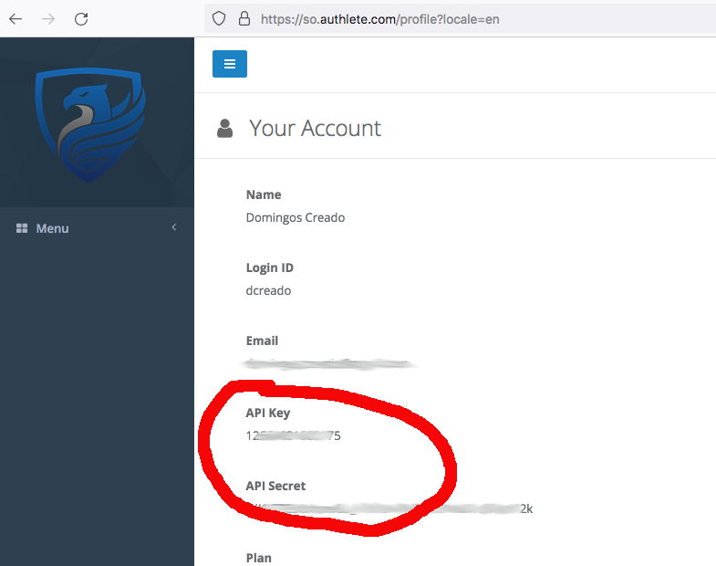

# Hello World Sample

This sample shows the minimal configuration required for managing a service on Authlete using [Terraform provider](https://registry.terraform.io/providers/authlete/authlete/latest).

## Creating an Authlete account

In this sample, we will use environment variables to configure the Authlete Terraform plugin.

To get started, head to [your profile page](https://so.authlete.com/profile?locale=en) and take note of `API Key` and `API Secret`.




after taking note, go to command line and run the command line below:

```sh
$ terraform init

Initializing the backend...

Initializing provider plugins...
- Finding authlete/authlete versions matching ">= 0.1.0"...
- Installing authlete/authlete v0.1.0...
- Installed authlete/authlete v0.1.0 (self-signed, key ID E51D52BC3A580750)

Partner and community providers are signed by their developers.
If you'd like to know more about provider signing, you can read about it here:
https://www.terraform.io/docs/cli/plugins/signing.html

Terraform has created a lock file .terraform.lock.hcl to record the provider
selections it made above. Include this file in your version control repository
so that Terraform can guarantee to make the same selections by default when
you run "terraform init" in the future.

Terraform has been successfully initialized!

You may now begin working with Terraform. Try running "terraform plan" to see
any changes that are required for your infrastructure. All Terraform commands
should now work.

If you ever set or change modules or backend configuration for Terraform,
rerun this command to reinitialize your working directory. If you forget, other
commands will detect it and remind you to do so if necessary.
```

at this stage Terraform has downloaded the Authlete provider and installed locally for you.
Please note the version installed might the latest.

After the initialization, run the commands below. You should receive a response like below:

```sh
$ export AUTHLETE_SO_KEY="XXXXXXXXXXXXXX"
$ export AUTHLETE_SO_SECRET="XXXXXXXXXXXXXXXXXXXXXXXXXXXXXX"
$ terraform apply --auto-approve

Terraform used the selected providers to generate the following execution plan. Resource actions are indicated with the following symbols:
  + create

Terraform will perform the following actions:

  # authlete_service.as will be created
  + resource "authlete_service" "as" {
      + api_secret                            = (known after apply)
      + client_id_alias_enabled               = false
      + description                           = "A terraform based service for managing the Authlete based OAuth server"
      + direct_authorization_endpoint_enabled = false
      + direct_introspection_endpoint_enabled = false
      + direct_jwks_endpoint_enabled          = false
      + direct_revocation_endpoint_enabled    = false
      + direct_token_endpoint_enabled         = false
      + direct_user_info_endpoint_enabled     = false
      + id                                    = (known after apply)
      + issuer                                = "https://as.mydomain.com"
      + service_name                          = "MyDomainAS"
      + single_access_token_per_subject       = true
      + supported_grant_types                 = [
          + "AUTHORIZATION_CODE",
        ]
      + supported_response_types              = [
          + "CODE",
        ]
    }

Plan: 1 to add, 0 to change, 0 to destroy.

Changes to Outputs:
  + api_key    = (known after apply)
  + api_secret = (sensitive value)
authlete_service.as: Creating...
authlete_service.as: Creation complete after 6s [id=22999002666159]

Apply complete! Resources: 1 added, 0 changed, 0 destroyed.

Outputs:

api_key = "22999002666159"
api_secret = <sensitive>

```

Congratulations! you have created a service in Authlete from Terraform.

To check the new service, go to the [Service list on Service Owner console](https://so.authlete.com/services?locale=en).

To login on the Developers console of the new service, go to command line and check the api_key and api_secret for the new service:

```sh
$ terraform output api_key
"22999002666159"
$ terraform output api_secret
"RtkKFbVqXXXXXXXXXXXXXXXXG6CNITo"
```
